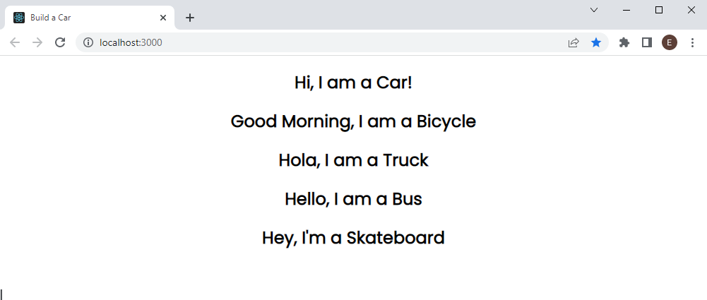
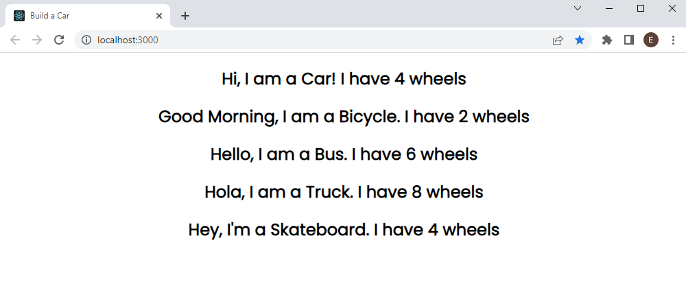

# Build a Car

## Task: Write a Car Component

1. The code in the example describes a very simple __functional component__ called `Car`.

1. It will display the text "Hi, I am a Car!"

1. Open the [build-a-car][1] folder.

1. Add a file called __Car.js__ to the components folder 

1. Copy the example code into the file [Car.js][2]

```js
import React from 'react'

export default function Car() {
  return <h2>Hi, I am a Car!</h2>;
}
```

6. Open the file [App.js][3]
1. Add an import statement for the __Car.js__ file
1. Delete the `<header>` element and it's children
1. Return the Car component in the App:<br/>The main App should now display the text "Hi, I am a car!"


10. Create the following components and call them from your main app:
  - Bicycle
  - Truck
  - Bus
  - Skateboard
<br/><br/>Each component should describe itself, e.g. 
"Hello, I am a Bus"
"Good Morning, I am a Bicycle"
"Hey, I'm a Skateboard"

```js
import React from 'react'

export default function App() {
  return (
    <h1 className="app">
		 <Car/>
		 <Bicycle/>
		 <Truck/>
		 <Bus/>
		 <Skateboard/>
    </h1>
  );
}
```



## Task: `numberOfWheels` Property

1. If we wanted to pass a property called `numberOfWheels` to our `Car` component we would pass it as a property, for example:

```js
import Car from "./Car";

export default function App() {
  return (
    <h1 className="App">
      <Car numberOfWheels="4"/>
    </h1>
  );
}

```

2. To display the number of wheels for our `Car` component we will need to reference the `numberOfWheels` in our `Car` component return statement
1. When properties are passed to a component, they are stored in a __props__ object
1. To reference the property, we need to use dot notation e.g. `props.numberOfWheels`

```js
export default function Car(props) {
  return <h2>Hi, I am a Car! I have {props.numberOfWheels} wheels</h2>;
}
```
5. Add the `numberOfWheels` prop to all of the other __components__. Ensure all your components display the correct number of wheels.
1. Your output should look like this:



## Task: Nested Components

1. Download an image of a wheel or find one [here][4]

1. Add the image to your project under the (imgs)[5] directory
1. Add a new file called `Wheel.js` in the components directory:

```js
export default function Wheel() {
  return ;
}
```
4. Our new Wheel component will be a child of the Car component.
1. We nest components by calling the child component inside it.
1. To display one wheel in our wheel component we can declare it once:
```js
export default function Car(props) {
  return (<>
        <h2>Hi, I am a Car! I have {props.numberOfWheels} wheels</h2>
        <Wheel/>
      </>
    );
}
```
<br/>Try it for yourself!


[1]:/build-a-car/
[2]:/build-a-car/src/components/
[3]:/build-a-car/src/App.js
[4]:/build-a-car/docs/docs/wheel.png
[3]:/build-a-car/public/imgs/